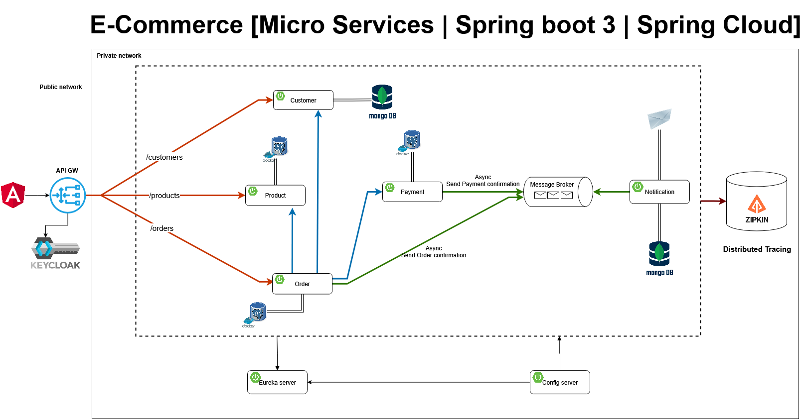
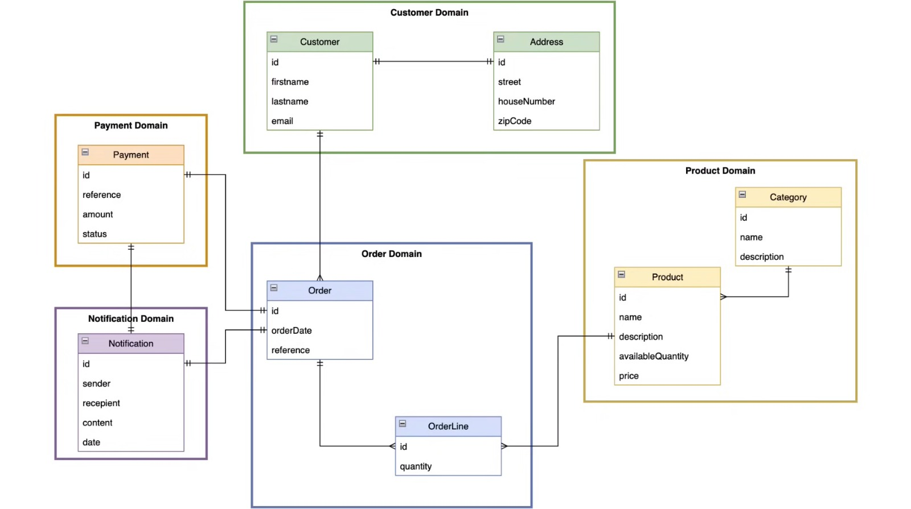

# 🛒 E-commerce App (Microservicios con Spring Boot)

Proyecto personal de arquitectura de **microservicios**, implementando tecnologías como **Java, Spring, Docker** y muchas otras.
Este proyecto implementa un sistema básico de e-commerce con sus usuarios, productos y pedidos, siguiendo buenas prácticas de arquitectura distribuida.

## 🚀 Tecnologías usadas
- Java 17
- Spring Boot 3 (REST, JPA, Security, Hibernate)
- Spring Cloud (Eureka, API Gateway, Config Server)
- Docker & Docker Compose
- Base de datos (PostgreSQL / MongoDB)
- Kafka para mensajería
- Keycloak para control de acceso a la aplicación
- ZipKin para trazabilidad
- Thymeleaf para creación de plantillas(Plantillas para correos en nuestro caso)
- DDD (Domain-Driven Design) arquitectura orientada al dominio

## 🏗️ Patrones y buenas prácticas
- **DDD (Domain-Driven Design)**: separación clara entre dominio, aplicación, infraestructura y presentación.
- **Microservicios** desacoplados y escalables.
- **Handlers** para el manejo de errores.


## 📐 Arquitectura del sistema




## 🗄️ Diagrama de la base de datos



## 📖 Descripción del proyecto

Este proyecto implementa un sistema de e-commerce distribuido basado en microservicios, diseñado como backend con una API REST completa. Cada microservicio se centra en un dominio específico y se comunica de manera desacoplada, siguiendo buenas prácticas de Domain-Driven Design (DDD).

**Customer Service**: Gestiona los clientes que se registran en la aplicación. Proporciona endpoints CRUD para crear, actualizar, consultar y eliminar usuarios.

**Product Service**: Permite gestionar los productos disponibles en la tienda, incluyendo funcionalidades CRUD para añadir, modificar, consultar o eliminar productos.

**Orders Service**: Maneja los pedidos realizados por los clientes, integrando los microservicios de Customer y Product para validar usuarios y productos.

**Payment Service**: Gestiona los pagos asociados a los pedidos. Actualmente es un microservicio de simulación; la integración con sistemas de pago como PayPal o Stripe puede añadirse en futuras mejoras.

**Notification Service**: Responsable de enviar correos electrónicos a los clientes confirmando pedidos y pagos. Funciona como consumidor de mensajes de Kafka generados por los servicios de Orders y Payment.


Además, la arquitectura incluye componentes de infraestructura y soporte:

**API Gateway**: Punto de entrada único que enruta las solicitudes hacia los microservicios correspondientes.

**Eureka Server y Config Server**: Registro de servicios y configuración centralizada.

**ZipKin**: Trazabilidad de las peticiones para facilitar la monitorización y el debugging.

**Keycloak**: Gestión de autenticación y control de acceso a la API.

Este enfoque permite que cada microservicio sea escalable, independiente y fácil de mantener, al mismo tiempo que proporciona una visión clara y profesional de la arquitectura de backend de la aplicación.

## ⚙️ Instalación y ejecución

1. Clonar el repositorio:
```bash
git clone https://github.com/AndyCipleu/ecommerceApp.git # Para clonar el proyecto
cd ecommerceApp
```

2. Levantar los contenedores con Docker Compose:

```bash
docker-compose up --build -d   # Para ejecución en segundo plano junto con logs
docker-compose up -d           # Para ejecución rápida en segundo plano sin logs
```

3. Acceso a servicios:

- API Gateway: http://localhost:8222, Punto de entrada a los microservicios.
- Eureka Server: http://localhost:8761, Registro y descubrimiento de microservicios.
- Mongo Express: http://localhost:8081, Administración de la base de datos MongoDB.
- PostgreSQL: puerto 5432, Base de datos relacional.
- MongoDB: puerto 27017, Base de datos no relacional.
- Kafka: puerto 9092, Mensajería interna entre servicios (Orders → Notifications, Payments → Notifications).
- MailDev: http://localhost:1080, Visualización de correos enviados por el microservicio Notification.
- ZipKin: http://localhost:9411, Trazabilidad de peticiones entre microservicios.
- Keycloak: http://localhost:9098, Control de acceso y autenticación.


4. Probar la API rápidamente

- Puedes importar esta colección en Postman para probar todos los endpoints de la API:
- [Descargar colección de Postman](./postman/Java-Microservices-Ecommerce.postman_collection.json)


## 🔮 Futuras mejoras / Roadmap

- Integración de pasarelas de pago reales (PayPal, Stripe).

- Despliegue de la arquitectura con Kubernetes.

- Implementación de CI/CD para despliegue automático y tests.

- Añadir tests automatizados (unitarios e integración).

- Mejorar el sistema de autenticación y roles en Keycloak.

- Añadir más validaciones y control de errores en los microservicios.

## ✉️ Autor / Contacto

Nombre: Andy Cipleu

LinkedIn: https://www.linkedin.com/in/andrei-claudiu-cipleu-30a625300/

Email: andycipleu@gmail.com

GitHub: https://github.com/AndyCipleu
